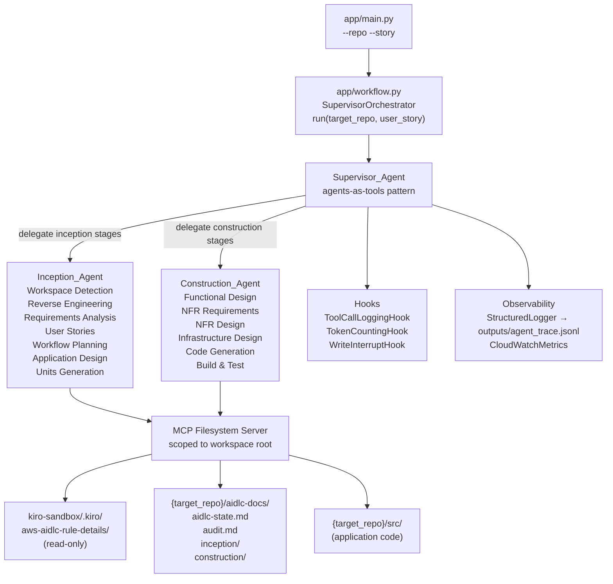
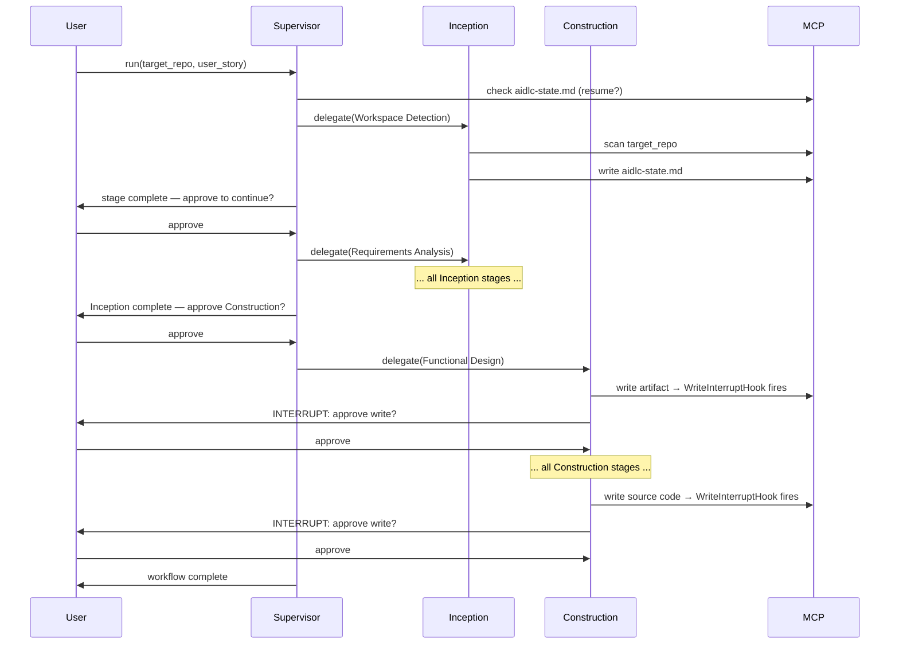

# Design Document: AI-DLC Strands Agent

## Overview

The AI-DLC Strands Agent is a Python CLI application that demonstrates the AWS Strands Agents SDK by implementing the full AI-Driven Development Life Cycle (AI-DLC) adaptive workflow. The user provides a target repository path and a user story; the agent analyzes the repo, walks through all AI-DLC stages with human-in-the-loop approvals at each stage, and ultimately writes generated application code directly into the target repo's source tree.

The system uses a three-agent **Supervisor pattern**: a top-level `Supervisor_Agent` that delegates to a specialized `Inception_Agent` (all Inception phase stages) and `Construction_Agent` (all Construction phase stages). All AI-DLC planning artifacts are written to `{target_repo}/aidlc-docs/`; all generated application code is written to `{target_repo}/src/` (or the equivalent source tree). These two write paths are enforced by separate skills with Python-level path validation.

### Invocation

```
python -m app.main --repo kiro-sandbox/services/java-api --story "As a user, I want to reset my password"
```

### Key Design Decisions

1. **Separate write paths** — `write_aidlc_artifact` is path-validated to only write inside `{target_repo}/aidlc-docs/`; `write_source_file` is path-validated to only write inside `{target_repo}/` but outside `aidlc-docs/`. Both raise `ValueError` at the Python level if the path constraint is violated. Neither skill can write to the other's directory.

2. **Agents-as-tools supervisor** — `Supervisor_Agent` registers `Inception_Agent` and `Construction_Agent` as callable tools using the Strands agents-as-tools pattern. The supervisor never executes stage logic directly; it always delegates to the appropriate sub-agent.

3. **Single MCP server** — A single MCP filesystem server instance is scoped to the workspace root (covering both `kiro-sandbox/.kiro/` for rule files and `{target_repo}/` for the target repo). The server is shared across all agents via the supervisor.

4. **State-driven resumption** — `{target_repo}/aidlc-docs/aidlc-state.md` is the single source of truth for workflow progress. On startup, the supervisor reads this file to determine whether to start fresh or resume from the last incomplete stage.

5. **Interrupt before every write** — `WriteInterruptHook` fires before every `write_file` MCP tool call, regardless of whether it is an artifact or source file. The hook displays the file type (ARTIFACT or SOURCE CODE), path, and content preview, then waits up to 60 seconds for "approve" or "reject".

6. **Reuse existing utilities** — `app/errors.py`, `app/retry.py`, `app/hooks/logging_hook.py`, `app/hooks/token_hook.py`, `app/observability/logger.py`, and `app/observability/metrics.py` are already implemented and are kept as-is.

---

## Architecture



### Workflow Sequence



---

## Components and Interfaces

### `app/main.py` — CLI Entry Point

```python
def main() -> None:
    # argparse: --repo (required), --story (required), --model-id, --dry-run
    # validate_env() → raises ConfigurationError if AWS_REGION missing
    # SupervisorOrchestrator(model_id).run(target_repo, user_story)
    # print JSON result; exit 0/1
```

**CLI arguments:**
- `--repo` / `-r`: target repository path (required)
- `--story` / `-s`: user story text (required)
- `--model-id` / `-m`: Bedrock model ID (default: `us.anthropic.claude-3-5-sonnet-20241022-v2:0`)
- `--dry-run`: validate environment and print config without invoking agents

### `app/workflow.py` — `SupervisorOrchestrator`

```python
class SupervisorOrchestrator:
    def __init__(self, model_id: str = DEFAULT_MODEL_ID) -> None: ...
    def run(self, target_repo: str, user_story: str) -> dict[str, Any]: ...
    def _get_mcp_tools(self) -> list: ...
    def _checkpoint_state(self) -> None: ...
    def _build_result(self, error: str | None = None, ...) -> dict: ...
```

`run()` responsibilities:
1. Check `{target_repo}/aidlc-docs/aidlc-state.md` for resumption
2. Build `Supervisor_Agent` with `Inception_Agent` and `Construction_Agent` as tools
3. Invoke supervisor with `target_repo` + `user_story`
4. Checkpoint state to `outputs/session_state.json` after each phase
5. Publish session metrics to CloudWatch at end of run

### `app/agents/supervisor_agent.py` — `Supervisor_Agent`

```python
def build_supervisor_agent(
    model_id: str,
    inception_agent: Agent,
    construction_agent: Agent,
    shared_state: dict,
    hooks: list,
) -> Agent: ...
```

- Registers `inception_agent` and `construction_agent` as tools via Strands agents-as-tools pattern
- System prompt: full AI-DLC workflow description + steering to check `aidlc-state.md` before each stage + steering to present stage completion summaries and wait for user approval
- Manages shared state including `target_repo`, `user_story`, and per-stage results

### `app/agents/inception_agent.py` — `Inception_Agent` (rewrite)

```python
def build_inception_agent(
    model_id: str,
    mcp_tools: list,
    shared_state: dict,
    hooks: list,
    rules_base_path: str = "kiro-sandbox/.kiro/aws-aidlc-rule-details",
) -> Agent: ...
```

**Tools:** `load_rule_file`, `update_workflow_state`, `file_read` (community), MCP tools

**Stages handled:**
- Workspace Detection (always)
- Reverse Engineering (brownfield only)
- Requirements Analysis (always)
- User Stories (conditional)
- Workflow Planning (always)
- Application Design (conditional)
- Units Generation (conditional)

**Artifacts written to** `{target_repo}/aidlc-docs/inception/`

### `app/agents/construction_agent.py` — `Construction_Agent` (rewrite)

```python
def build_construction_agent(
    model_id: str,
    mcp_tools: list,
    shared_state: dict,
    hooks: list,
    rules_base_path: str = "kiro-sandbox/.kiro/aws-aidlc-rule-details",
) -> Agent: ...
```

**Tools:** `load_rule_file`, `write_aidlc_artifact`, `write_source_file`, `update_workflow_state`, `file_read` (community), MCP tools

**Stages handled:**
- Functional Design (conditional, per-unit)
- NFR Requirements (conditional, per-unit)
- NFR Design (conditional, per-unit)
- Infrastructure Design (conditional, per-unit)
- Code Generation (always, per-unit)
- Build and Test (always)

**Artifacts written to** `{target_repo}/aidlc-docs/construction/`
**Source code written to** `{target_repo}/src/` (or existing source tree)

### `WriteInterruptHook` (in `construction_agent.py`)

```python
class WriteInterruptHook(HookProvider):
    MCP_WRITE_TOOL = "write_file"
    TIMEOUT_SECONDS = 60

    def register_hooks(self, registry: HookRegistry, **kwargs) -> None: ...
    def _approve_write(self, event: BeforeToolCallEvent) -> None: ...
```

Fires before every `write_file` MCP call. Determines file type (ARTIFACT if path contains `aidlc-docs`, SOURCE CODE otherwise). Displays type, path, and content preview (first 500 chars). Waits 60s for "approve"/"reject". Raises `InterruptedError` on reject or timeout.

---

## Skills

All skills are `@tool`-decorated functions in `app/skills/`.

### `load_rule_file(stage_name: str) -> str`
**File:** `app/skills/load_rule_file.py`

Reads the rule file for the given stage from `kiro-sandbox/.kiro/aws-aidlc-rule-details/`. Maps stage names to file paths:

| Stage Name | File Path |
|---|---|
| `workspace-detection` | `inception/workspace-detection.md` |
| `reverse-engineering` | `inception/reverse-engineering.md` |
| `requirements-analysis` | `inception/requirements-analysis.md` |
| `user-stories` | `inception/user-stories.md` |
| `workflow-planning` | `inception/workflow-planning.md` |
| `application-design` | `inception/application-design.md` |
| `units-generation` | `inception/units-generation.md` |
| `functional-design` | `construction/functional-design.md` |
| `nfr-requirements` | `construction/nfr-requirements.md` |
| `nfr-design` | `construction/nfr-design.md` |
| `infrastructure-design` | `construction/infrastructure-design.md` |
| `code-generation` | `construction/code-generation.md` |
| `build-and-test` | `construction/build-and-test.md` |

Raises `SkillOutputError` if the stage name is unknown or the file content is shorter than 10 characters.

### `write_aidlc_artifact(target_repo: str, relative_path: str, content: str) -> str`
**File:** `app/skills/write_aidlc_artifact.py`

Writes a planning artifact to `{target_repo}/aidlc-docs/{relative_path}`. Path validation (Python-level):
- Resolves the absolute path of the target file
- Asserts the resolved path starts with `{abs(target_repo)}/aidlc-docs/`
- Raises `ValueError` if the constraint is violated
- Creates parent directories as needed
- Returns the absolute path written

### `write_source_file(target_repo: str, relative_path: str, content: str) -> str`
**File:** `app/skills/write_source_file.py`

Writes generated application code to `{target_repo}/{relative_path}`. Path validation (Python-level):
- Resolves the absolute path of the target file
- Asserts the resolved path starts with `abs(target_repo)`
- Asserts the resolved path does NOT contain `/aidlc-docs/`
- Raises `ValueError` if either constraint is violated
- Creates parent directories as needed
- Returns the absolute path written

### `update_workflow_state(target_repo: str, stage_name: str, status: str) -> str`
**File:** `app/skills/update_workflow_state.py`

Updates `{target_repo}/aidlc-docs/aidlc-state.md` with the stage completion entry and appends a timestamped entry to `{target_repo}/aidlc-docs/audit.md`.

State file format (Markdown with embedded JSON block):
```markdown
# AI-DLC State Tracking
...
## Stage Progress
```json
{
  "last_completed_stage": "requirements-analysis",
  "completed_stages": ["workspace-detection", "requirements-analysis"],
  "current_stage": "workflow-planning",
  "updated_at": "2025-01-01T00:00:00Z"
}
```
```

Returns the updated state as a JSON string. The JSON block must be parseable and contain `last_completed_stage`, `completed_stages`, `current_stage`, and `updated_at` fields.

---

## Data Models

### Shared Workflow State (`shared_state: dict`)

```python
{
    "target_repo": str,           # e.g., "kiro-sandbox/services/java-api"
    "user_story": str,            # e.g., "As a user, I want to reset my password"
    "project_type": str,          # "greenfield" | "brownfield"
    "inception": {
        "status": str,            # "in_progress" | "complete" | "failed"
        "completed_stages": list[str],
        "artifact_paths": dict[str, str],  # stage_name → artifact path
        "duration_ms": float,
    },
    "construction": {
        "status": str,
        "completed_stages": list[str],
        "artifact_paths": dict[str, str],
        "source_files_written": list[str],
        "duration_ms": float,
    },
    "session_metrics": {
        "total_tool_calls": int,
        "total_retries": int,
        "total_tokens": int,
        "total_duration_ms": float,
        "total_stages_completed": int,
    },
}
```

### `aidlc-state.md` JSON Block

```json
{
  "project_type": "greenfield | brownfield",
  "workspace_root": "/absolute/path/to/target_repo",
  "last_completed_stage": "stage-name",
  "completed_stages": ["stage-name", ...],
  "current_stage": "stage-name",
  "updated_at": "ISO-8601 timestamp"
}
```

### Evaluation Case (`evals/cases.json`)

```json
{
  "name": "case_name",
  "target_repo": "path/to/repo",
  "user_story": "As a user, I want to...",
  "expected": {
    "state_file_created": true,
    "requires_clarification": false,
    "violates_steering": false,
    "audit_entries_min": 1,
    "completed_stages_min": 1
  }
}
```

---

## Correctness Properties

*A property is a characteristic or behavior that should hold true across all valid executions of a system — essentially, a formal statement about what the system should do. Properties serve as the bridge between human-readable specifications and machine-verifiable correctness guarantees.*

### Property 1: `write_aidlc_artifact` path constraint

*For any* `target_repo` path and `relative_path` input, the file written by `write_aidlc_artifact` SHALL always resolve to a path inside `{target_repo}/aidlc-docs/`. Any `relative_path` that would resolve outside `aidlc-docs/` (including path traversal attempts like `../../src/`) SHALL raise a `ValueError` before any file is written.

**Validates: Requirements 4.2, 4.8, 5.4**

### Property 2: `write_source_file` path constraint

*For any* `target_repo` path and `relative_path` input, the file written by `write_source_file` SHALL always resolve to a path inside `{target_repo}/` but never inside `{target_repo}/aidlc-docs/`. Any `relative_path` that resolves outside `target_repo` or into `aidlc-docs/` SHALL raise a `ValueError` before any file is written.

**Validates: Requirements 4.3, 4.9, 5.5**

### Property 3: State checkpoint round-trip

*For any* `stage_name` and `status` string passed to `update_workflow_state`, the resulting `aidlc-state.md` file SHALL contain a JSON block that is parseable and contains all four required fields: `last_completed_stage`, `completed_stages`, `current_stage`, and `updated_at`.

**Validates: Requirements 4.4, 4.10, 14.4**

### Property 4: `load_rule_file` completeness

*For any* stage name in the set of known AI-DLC stage names (`workspace-detection`, `reverse-engineering`, `requirements-analysis`, `user-stories`, `workflow-planning`, `application-design`, `units-generation`, `functional-design`, `nfr-requirements`, `nfr-design`, `infrastructure-design`, `code-generation`, `build-and-test`), `load_rule_file` SHALL return a non-empty string of at least 10 characters.

**Validates: Requirements 4.1, 4.7, 8.2**

### Property 5: Token counter monotonicity

*For any* sequence of model invocations, the `TokenCountingHook`'s `total_tokens` counter SHALL be non-decreasing — each invocation either increases the counter or leaves it unchanged, but never decreases it.

**Validates: Requirements 6.3**

### Property 6: Tool call log completeness

*For any* tool name and input arguments, firing `BeforeToolCallEvent` on a `ToolCallLoggingHook` instance SHALL produce a log entry containing `type`, `agent_name`, `tool_name`, `input_args`, and `timestamp` fields. Firing `AfterToolCallEvent` SHALL produce a log entry containing `type`, `agent_name`, `tool_name`, `output_summary`, `duration_ms`, `status`, and `timestamp` fields.

**Validates: Requirements 6.1, 6.2**

### Property 7: Interrupt input validation

*For any* user response string, the `WriteInterruptHook` SHALL allow the write to proceed if and only if the response is exactly `"approve"` (case-insensitive). For any other string (including empty string, `"yes"`, `"ok"`, `"reject"`, or any arbitrary text), the hook SHALL cancel the tool call by raising `InterruptedError`.

**Validates: Requirements 7.2, 7.3, 7.4**

### Property 8: Retry count enforcement

*For any* `max_attempts` value in [1, 5], when `retry_with_backoff(max_attempts=N)` wraps a callable that always raises an exception, the callable SHALL be invoked exactly `N` times before `SkillOutputError` is raised. The `SkillOutputError` SHALL contain the correct `attempts` count and `last_error` message.

**Validates: Requirements 8.1, 8.5**

### Property 9: Partial result on workflow failure

*For any* exception type raised by the `Construction_Agent` after the `Inception_Agent` has completed successfully, the `SupervisorOrchestrator.run()` result dictionary SHALL contain the `inception` artifacts (non-empty) and an `"error"` key describing the failure. The result SHALL never be empty.

**Validates: Requirements 9.4, 9.5**

### Property 10: State resumption correctness

*For any* valid `aidlc-state.md` content where `last_completed_stage` is set to a known stage name, the `SupervisorOrchestrator` SHALL resume execution from the stage immediately following `last_completed_stage` — it SHALL NOT restart from `workspace-detection`. The set of stages delegated to sub-agents SHALL not include any stage already listed in `completed_stages`.

**Validates: Requirements 14.4, 14.5**

---

## Error Handling

### `ConfigurationError`
Raised by `validate_env()` in `main.py` when `AWS_REGION` is missing. Message names the missing variable(s). Causes CLI exit with code 1.

### `SkillOutputError`
Raised by `retry_with_backoff` when all attempts are exhausted. Fields: `operation_name`, `attempts`, `last_error`. Propagated to the supervisor, which logs the failure and returns a partial result.

### `ValueError` (path constraint violations)
Raised by `write_aidlc_artifact` and `write_source_file` when the resolved path violates the write-path constraint. Caught by the Construction_Agent, which logs the violation and requests revised instructions from the user.

### `InterruptedError` (write rejection)
Raised by `WriteInterruptHook` when the user rejects a write or the 60-second timeout expires. Caught by the Construction_Agent, which logs the rejection with a UTC timestamp and prompts the user for revised instructions.

### MCP server unavailability
If the MCP server is unavailable at startup, the supervisor logs a warning and continues using fallback direct file I/O tools from `strands-agents-tools`. The workflow proceeds in degraded mode.

### Unrecoverable agent errors
Any unhandled exception from a sub-agent is caught by the supervisor, which logs the full traceback, checkpoints the current state to `outputs/session_state.json`, and returns a partial result dictionary with an `"error"` key.

---

## Testing Strategy

### Dual Testing Approach

Both unit tests and property-based tests are used. Unit tests cover specific examples, integration points, and error conditions. Property tests verify universal invariants across many generated inputs.

### Property-Based Testing

Property-based tests use **Hypothesis** with `@settings(max_examples=100)`. Each test is tagged with a comment referencing the design property it validates:

```python
# Feature: ai-dlc-strands-agent, Property 1: write_aidlc_artifact path constraint
```

**Properties to implement as PBT:**
- P1: `write_aidlc_artifact` path constraint — `@given(target_repo=st.text(), relative_path=st.text())`
- P2: `write_source_file` path constraint — `@given(target_repo=st.text(), relative_path=st.text())`
- P3: State checkpoint round-trip — `@given(stage_name=st.sampled_from(KNOWN_STAGES), status=st.text(min_size=1))`
- P4: `load_rule_file` completeness — `@given(stage_name=st.sampled_from(KNOWN_STAGES))`
- P5: Token counter monotonicity — `@given(invocations=st.lists(st.tuples(st.integers(min_value=0), st.integers(min_value=0)), min_size=1))`
- P6: Tool call log completeness — `@given(tool_name=st.text(min_size=1), input_args=st.dictionaries(st.text(), st.text()))`
- P7: Interrupt input validation — `@given(response=st.text())`
- P8: Retry count enforcement — `@given(max_attempts=st.integers(min_value=1, max_value=5))`
- P9: Partial result on workflow failure — `@given(error_type=st.sampled_from([ValueError, RuntimeError, IOError]))`
- P10: State resumption correctness — `@given(last_completed_stage=st.sampled_from(KNOWN_STAGES[:-1]))`

### Unit Tests

- `tests/test_skills.py`: `load_rule_file` (known stages, unknown stage → SkillOutputError, short content → retry), `write_aidlc_artifact` (valid path, path traversal, outside aidlc-docs), `write_source_file` (valid path, into aidlc-docs → ValueError, outside target_repo → ValueError), `update_workflow_state` (creates files, appends to audit)
- `tests/test_hooks.py`: `ToolCallLoggingHook` (log fields), `TokenCountingHook` (counter increments), `WriteInterruptHook` (approve/reject/timeout)
- `tests/test_agents.py`: `build_inception_agent` (model, tools, system prompt), `build_construction_agent` (model, tools, system prompt, WriteInterruptHook attached), `build_supervisor_agent` (sub-agents as tools)
- `tests/test_workflow.py`: `SupervisorOrchestrator.run()` happy path, MCP unavailability fallback, interrupt approve/reject, partial result on failure, state resumption
- `tests/test_retry.py`: success on first attempt, success after one failure, exhaustion, SkillOutputError fields
- `tests/test_observability.py`: `StructuredLogger` JSONL format, `CloudWatchMetrics` boto3 calls
- `tests/test_main.py`: `validate_env()` missing vars, CLI exit codes

### Evaluation Suite (`evals/run_evals.py`)

Five evaluation cases in `evals/cases.json`:
1. `greenfield_simple` — verifies `aidlc-state.md` is created with `project_type: greenfield`
2. `brownfield_complex` — verifies Reverse Engineering stage is triggered
3. `ambiguous_description` — verifies agent requests clarification using `[Answer]:` tags
4. `steering_violation` — verifies agent refuses off-topic request with polite explanation
5. `full_inception_workflow` — verifies all Inception stages complete and `audit.md` has timestamped entries

Evaluators:
- `StateFileEvaluator`: checks `aidlc-state.md` exists and contains expected stage entries
- `AuditLogEvaluator`: checks `audit.md` contains timestamped entries for every stage approval
- `ClarificationEvaluator`: checks agent response contains `[Answer]:` tags or question marks
- `SteeringViolationEvaluator`: checks agent response contains refusal phrases
