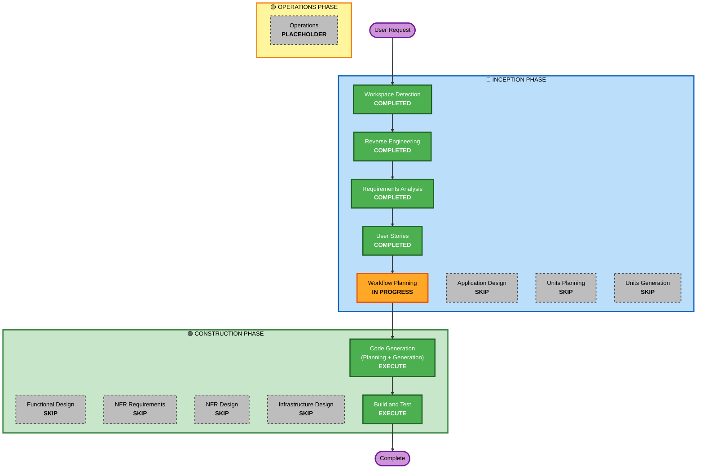

# Execution Plan

## Detailed Analysis Summary

### Request Analysis
- **User Request**: "As a user, I want to update my profile"
- **System Type**: Brownfield - Existing Spring Boot user management API
- **Change Type**: Feature Enhancement - Adding profile update capability to existing system

### Transformation Scope
- **Transformation Type**: Single Component Enhancement
- **Primary Changes**: Adding profile update functionality to existing User management components
- **Architecture Impact**: No architectural changes - leveraging existing 3-tier Spring Boot architecture

### Change Impact Assessment

#### Application Layer Impact
- **Code changes**: YES
  - Enhance UpdateUserRequest DTO with additional fields (name, email, role)
  - Implement UserService.updateUser() business logic 
  - Add REST endpoint in UserController for PUT /api/users/{userId}
  - Add validation and authorization logic
- **Dependencies**: NO - Uses existing Spring Boot, Spring Security, JPA dependencies
- **Configuration**: NO - Existing security and database configuration sufficient
- **Testing**: YES - Unit tests for service logic, integration tests for REST endpoints

#### Data Model Impact
- **Database schema**: NO - User entity already contains all required fields (name, email, role, active)
- **Data structures**: NO - Existing User entity is complete
- **API changes**: YES - New REST endpoint will be added
- **Data migration**: NO - No database changes required

#### Infrastructure Layer Impact
- **Deployment model**: NO - Existing Spring Boot JAR deployment continues
- **Networking**: NO - Uses existing HTTP endpoints and CORS configuration
- **Storage**: NO - Existing H2 database setup sufficient
- **Scaling**: NO - Single instance deployment model unchanged

#### Operations Layer Impact
- **Monitoring**: NO - Existing Spring Actuator monitoring sufficient
- **Logging**: NO - Existing Spring Boot logging framework sufficient
- **Alerting**: NO - No new alerting requirements
- **Deployment**: NO - Standard Spring Boot deployment process unchanged

### Component Relationships
- **Primary Component**: User API (java-api service)
- **Infrastructure Components**: None - self-contained Spring Boot application
- **Shared Components**: None - standalone service
- **Dependent Components**: None identified
- **Supporting Components**: Existing Spring Boot infrastructure (Security, Actuator, H2)

### Risk Assessment
- **Risk Level**: Low
- **Rollback Complexity**: Easy - Standard Spring Boot deployment rollback
- **Testing Complexity**: Simple - Standard REST API testing patterns
- **Impact Scope**: Limited to single service with no external dependencies
- **Security Impact**: Leverages existing authentication/authorization framework

**Risk Factors**:
- ✅ Well-understood domain (user profile management)
- ✅ Existing infrastructure complete and stable
- ✅ Clear requirements with comprehensive user stories
- ✅ No external service integrations
- ✅ Standard Spring Boot patterns and practices
- ✅ No database schema changes required

## Workflow Visualization

## Phases to Execute

### 🔵 INCEPTION PHASE
- [x] **Workspace Detection** (COMPLETED)
  - **Rationale**: Successfully identified brownfield Spring Boot project with existing User entity and infrastructure
- [x] **Reverse Engineering** (COMPLETED)
  - **Rationale**: Complete system architecture and component analysis completed for existing codebase
- [x] **Requirements Analysis** (COMPLETED) 
  - **Rationale**: Comprehensive requirements gathered including functional, non-functional, and technical requirements
- [x] **User Stories** (COMPLETED)
  - **Rationale**: Six detailed user stories created covering all personas and update scenarios
- [x] **Workflow Planning** (IN PROGRESS)
  - **Rationale**: Creating execution plan to determine optimal implementation approach
- [ ] **Application Design** - SKIP
  - **Rationale**: Existing 3-tier architecture (Controller → Service → Repository) is perfect for this enhancement. User entity, DTOs, security, and exception handling already exist. No new components or architectural changes needed.
- [ ] **Units Planning** - SKIP
  - **Rationale**: Single cohesive feature within existing User management components. No system decomposition required - all changes are within UserController, UserService, and DTOs.
- [ ] **Units Generation** - SKIP
  - **Rationale**: Not applicable since Units Planning is skipped. Single implementation unit.

### 🟢 CONSTRUCTION PHASE
- [ ] **Functional Design** - SKIP
  - **Rationale**: Business logic is straightforward CRUD operations with basic validation and authorization rules. No complex algorithms, state management, or data models needed. Requirements and user stories provide sufficient detail for implementation.
- [ ] **NFR Requirements** - SKIP
  - **Rationale**: No new NFR requirements. Existing Spring Boot infrastructure (security, performance, monitoring) meets all needs. No tech stack changes or new NFR patterns required.
- [ ] **NFR Design** - SKIP
  - **Rationale**: Not applicable since NFR Requirements is skipped. Existing NFR implementations sufficient.
- [ ] **Infrastructure Design** - SKIP
  - **Rationale**: No infrastructure changes. Existing H2 database, Spring Boot deployment, security configuration, and monitoring (Actuator) are sufficient for profile update functionality.
- [ ] **Code Generation** - EXECUTE (ALWAYS)
  - **Rationale**: Implementation planning and code generation required to enhance UpdateUserRequest DTO, implement UserService.updateUser() method, and add REST endpoint in UserController.
- [ ] **Build and Test** - EXECUTE (ALWAYS)
  - **Rationale**: Build instructions, unit tests, integration tests, and validation needed for new profile update functionality.

### 🟡 OPERATIONS PHASE
- [ ] **Operations** - PLACEHOLDER
  - **Rationale**: Future deployment and monitoring workflows (currently placeholder)

## Implementation Strategy

### Single-Unit Implementation
Since this is a focused enhancement to existing components:
- **No decomposition needed**: All changes within existing User management boundary
- **Coherent feature scope**: Profile update functionality is a single logical unit
- **Existing infrastructure**: Complete Spring Boot foundation already in place

### Development Approach
1. **Code Generation Phase**: 
   - Part 1 (Planning): Create detailed implementation plan with specific code changes
   - Part 2 (Generation): Generate enhanced DTOs, service methods, controller endpoints, and tests
2. **Build and Test Phase**: Provide comprehensive testing and build instructions

### Implementation Order
Based on user story dependencies identified:
1. **Phase 1**: US-001, US-002, US-003 (Core self-update with authorization)
2. **Phase 2**: US-004 (Admin capabilities for name/email) 
3. **Phase 3**: US-005, US-006 (Additional admin capabilities for role/active)

## Estimated Timeline
- **Total Phases**: 2 execution phases (Code Generation, Build and Test)
- **Code Generation**: ~2-3 hours (planning + implementation)
- **Build and Test**: ~1 hour (test instructions and validation)
- **Total Estimated Duration**: 3-4 hours

## Success Criteria
- **Primary Goal**: Enable authenticated users to update their profile information via REST API
- **Key Deliverables**: 
  - Enhanced UpdateUserRequest DTO with full field support
  - UserService.updateUser() method with business logic and authorization
  - PUT /api/users/{userId} REST endpoint in UserController
  - Comprehensive unit and integration tests
  - Updated API documentation
- **Quality Gates**:
  - All user story acceptance criteria met
  - Authorization rules properly enforced (self-update vs admin-update)
  - Email uniqueness validation working
  - Error handling for all specified scenarios (404, 400, 403, 409)
  - Integration with existing Spring Security authentication
  - Comprehensive test coverage for all scenarios

## Technical Implementation Summary

### Core Changes Required
1. **UpdateUserRequest DTO Enhancement**:
   - Add name, email, role fields with proper Jakarta validation annotations
   - Support partial updates (null checks for optional fields)

2. **UserService Implementation**:
   - `updateUser(Long userId, UpdateUserRequest request)` method
   - Authorization logic: self-update vs admin capabilities  
   - Email uniqueness validation
   - Partial update logic

3. **UserController REST Endpoint**:
   - `PUT /api/users/{userId}` endpoint
   - Request/response handling with proper HTTP status codes
   - Integration with existing GlobalExceptionHandler

4. **Test Coverage**:
   - Unit tests: UserService business logic scenarios
   - Integration tests: REST endpoint scenarios including security
   - All user story acceptance criteria validation

### Leveraging Existing Infrastructure
- **Security**: HTTP Basic authentication with existing UserDetailsService
- **Data Access**: Existing UserRepository with JPA/H2 database
- **Validation**: Jakarta Bean Validation framework  
- **Error Handling**: Existing GlobalExceptionHandler patterns
- **Monitoring**: Spring Boot Actuator health checks
- **API Documentation**: SpringDoc OpenAPI automatic documentation

This execution plan optimizes for efficiency by skipping unnecessary design phases while ensuring comprehensive implementation of the profile update feature within the existing, well-established Spring Boot architecture.