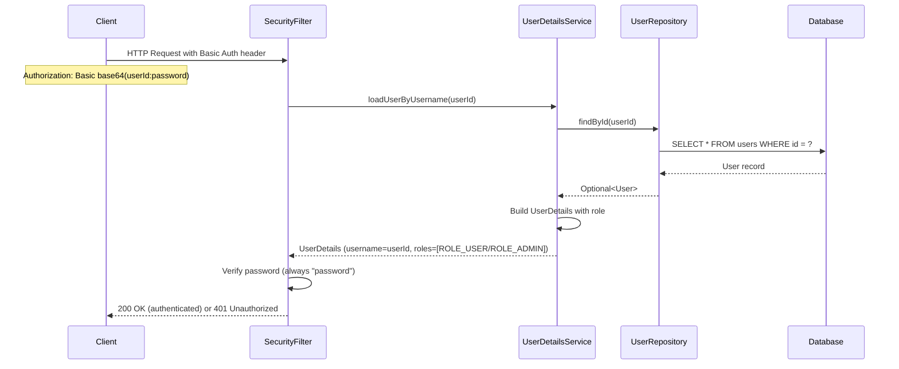

# API Documentation

## REST APIs

Currently, the UserController has no implemented endpoints. This section documents the expected API structure based on the existing infrastructure and the user story requirement ("As a user, I want to update my profile").

### Expected Endpoints (Based on Infrastructure)

#### Update User Profile
- **Method**: PUT
- **Path**: `/api/users/{id}` (expected based on controller mapping)
- **Purpose**: Update a user's profile information
- **Authentication**: Required (HTTP Basic Auth)
- **Authorization**: Users can update their own profile; ADMIN can update any profile
- **Request**: 
  ```json
  {
    "active": true
  }
  ```
  - Currently only supports updating `active` status based on existing UpdateUserRequest DTO
  - Expected to be extended with: name, email, role fields
- **Response**: 
  ```json
  {
    "id": 1,
    "name": "John Doe",
    "email": "john@example.com",
    "role": "USER",
    "active": true
  }
  ```
- **Status Codes**:
  - `200 OK` - Profile updated successfully
  - `400 Bad Request` - Invalid request data
  - `403 Forbidden` - User not authorized to update this profile
  - `404 Not Found` - User not found
- **Current State**: Not implemented - endpoint does not exist yet

#### Get User Profile (Anticipated)
- **Method**: GET
- **Path**: `/api/users/{id}` (expected)
- **Purpose**: Retrieve a user's profile information
- **Authentication**: Required (HTTP Basic Auth)
- **Authorization**: Users can view their own profile; ADMIN can view any profile
- **Request**: None (path parameter only)
- **Response**: 
  ```json
  {
    "id": 1,
    "name": "John Doe",
    "email": "john@example.com",
    "role": "USER",
    "active": true
  }
  ```
- **Status Codes**:
  - `200 OK` - Profile retrieved successfully
  - `403 Forbidden` - User not authorized to view this profile
  - `404 Not Found` - User not found
- **Current State**: Not implemented

### Public Endpoints (Infrastructure)

#### H2 Database Console
- **Method**: GET
- **Path**: `/h2-console/**`
- **Purpose**: Web-based database console for development
- **Authentication**: Not required (public access)
- **Current State**: Enabled in SecurityConfig

#### Spring Boot Actuator
- **Method**: GET
- **Path**: `/actuator/**`
- **Purpose**: Health checks and application monitoring
- **Authentication**: Not required (public access)
- **Example Endpoints**:
  - `/actuator/health` - Application health status
  - `/actuator/info` - Application information
- **Current State**: Enabled in SecurityConfig

#### API Documentation
- **Method**: GET
- **Path**: 
  - `/swagger-ui.html` - Swagger UI interactive documentation
  - `/swagger-ui/**` - Swagger UI static resources
  - `/v3/api-docs` - OpenAPI 3.0 specification (JSON)
  - `/v3/api-docs/**` - OpenAPI specification variants
- **Purpose**: Interactive API documentation and testing
- **Authentication**: Not required (public access)
- **Current State**: Enabled via SpringDoc OpenAPI integration

## Internal APIs

### UserService (Business Logic Interface)

No methods currently defined. Expected methods based on the user story and infrastructure:

#### updateUser (Expected)
- **Signature**: `UserResponse updateUser(Long userId, UpdateUserRequest request, String authenticatedUserId)`
- **Parameters**:
  - `userId` - ID of user to update
  - `request` - UpdateUserRequest DTO with fields to update
  - `authenticatedUserId` - ID of currently authenticated user (for authorization)
- **Return Type**: `UserResponse` - Updated user data
- **Exceptions**:
  - `ResourceNotFoundException` - User not found
  - `ForbiddenException` - User not authorized to update this profile
  - `BadRequestException` - Invalid request data
- **Business Rules**:
  - Users can only update their own profile unless they have ADMIN role
  - Email must remain unique across all users
  - Active status can only be changed by ADMIN role
- **Current State**: Not implemented

#### getUserById (Expected)
- **Signature**: `UserResponse getUserById(Long userId, String authenticatedUserId)`
- **Parameters**:
  - `userId` - ID of user to retrieve
  - `authenticatedUserId` - ID of currently authenticated user (for authorization)
- **Return Type**: `UserResponse` - User data
- **Exceptions**:
  - `ResourceNotFoundException` - User not found
  - `ForbiddenException` - User not authorized to view this profile
- **Business Rules**:
  - Users can only view their own profile unless they have ADMIN role
- **Current State**: Not implemented

### UserRepository (Data Access Interface)

#### Inherited from JpaRepository<User, Long>

Standard CRUD operations automatically provided by Spring Data JPA:

- **`findById(Long id)`** - Find user by ID
  - **Return**: `Optional<User>`
  - **Current State**: Fully functional (used in SecurityConfig.userDetailsService)

- **`save(User user)`** - Create or update user
  - **Return**: `User` (persisted entity with ID)
  - **Current State**: Fully functional (used in test setup)

- **`deleteAll()`** - Delete all users
  - **Return**: `void`
  - **Current State**: Fully functional (used in test setup)

- **`findAll()`** - Retrieve all users
  - **Return**: `List<User>`
  - **Current State**: Fully functional

- **`delete(User user)`** - Delete specific user
  - **Return**: `void`
  - **Current State**: Fully functional

- **`existsById(Long id)`** - Check if user exists
  - **Return**: `boolean`
  - **Current State**: Fully functional

#### Custom Query Methods (Expected)

- **`findByEmail(String email)`** - Find user by unique email
  - **Return**: `Optional<User>`
  - **Purpose**: Enforce email uniqueness, lookup by email
  - **Current State**: Not implemented (will be needed for validation)

- **`existsByEmail(String email)`** - Check if email is already taken
  - **Return**: `boolean`
  - **Purpose**: Validate email uniqueness before updates
  - **Current State**: Not implemented

## Data Models

### User (JPA Entity)

**Database Table**: `users`

**Fields**:

| Field | Type | Constraints | Description |
|-------|------|-------------|-------------|
| id | Long | Primary Key, Auto-generated | Unique user identifier |
| name | String | Not Null, Max Length 100 | User's full name |
| email | String | Not Null, Unique | User's email address (unique) |
| role | String | Not Null, Max Length 20 | User's role (e.g., USER, ADMIN) |
| active | boolean | Not Null, Default true | Whether user account is active |

**Relationships**: None currently defined

**Validation**: Enforced at database level via JPA annotations

**Indexes**: 
- Primary key on `id`
- Unique constraint on `email`

### UserResponse (DTO)

**Purpose**: Outbound data transfer object for API responses

**Fields**:

| Field | Type | Description |
|-------|------|-------------|
| id | Long | User identifier |
| name | String | User's full name |
| email | String | User's email address |
| role | String | User's role |
| active | boolean | Account active status |

**Factory Method**: `static UserResponse from(User user)` - Transforms User entity to UserResponse

**Validation**: None (response DTO)

### UpdateUserRequest (DTO)

**Purpose**: Inbound data transfer object for user update requests

**Fields**:

| Field | Type | Validation | Description |
|-------|------|------------|-------------|
| active | Boolean | @NotNull | Account active status |

**Current Limitations**: 
- Only supports updating `active` field
- Missing fields: name, email, role
- Need to extend for complete profile update functionality

**Validation Rules**:
- `active` field is required (cannot be null)

**Expected Extension** (for profile updates):
```java
public record UpdateUserRequest(
    String name,     // Optional
    String email,    // Optional, must be unique, must be valid email format
    String role,     // Optional, ADMIN only
    Boolean active   // Optional, ADMIN only
) {}
```

## Authentication & Authorization

### Authentication Flow



### Authorization Rules (Configured in SecurityConfig)

**Public Access**:
- `/h2-console/**` - H2 database console
- `/actuator/**` - Spring Boot Actuator endpoints
- `/swagger-ui/**`, `/swagger-ui.html`, `/v3/api-docs/**` - API documentation

**Authenticated Access**:
- All other endpoints require authentication (`.anyRequest().authenticated()`)

**Authentication Method**:
- HTTP Basic Authentication
- Username = User's database ID (as string)
- Password = "password" (hardcoded, same for all users - **NOT production-ready**)

**User Details**:
- Loaded from database via custom UserDetailsService
- Username = User.id (converted to string)
- Password = "password" (hardcoded)
- Roles = ROLE_{user.role} (e.g., ROLE_USER, ROLE_ADMIN)

### Expected Authorization Logic (Not Yet Implemented)

For profile update endpoint:
- User can update their own profile (userId matches authenticated user ID)
- ADMIN role can update any profile
- Regular users cannot change `role` or `active` fields (ADMIN only)

## CORS Configuration

**Allowed Origins**: All origins (`*` pattern)

**Allowed Methods**: GET, POST, PUT, DELETE, OPTIONS

**Allowed Headers**: All headers (`*`)

**Credentials**: Allowed (true)

**Configuration Location**: SecurityConfig.corsConfigurationSource()

## API Documentation Access

**Swagger UI**: http://localhost:8080/swagger-ui.html
- Interactive API documentation
- Test endpoints directly from browser
- View request/response schemas

**OpenAPI Spec**: http://localhost:8080/v3/api-docs
- Machine-readable API specification
- JSON format
- OpenAPI 3.0 standard

**Current State**: Infrastructure is in place, but no endpoints are documented yet since none are implemented.
