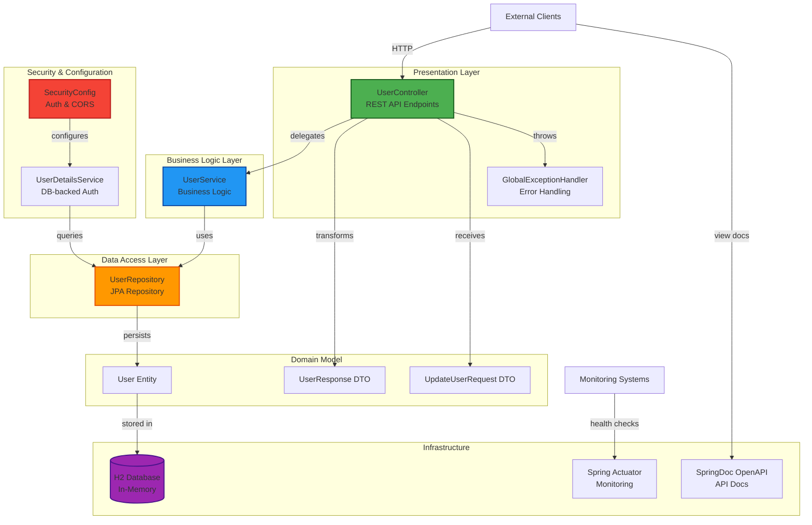
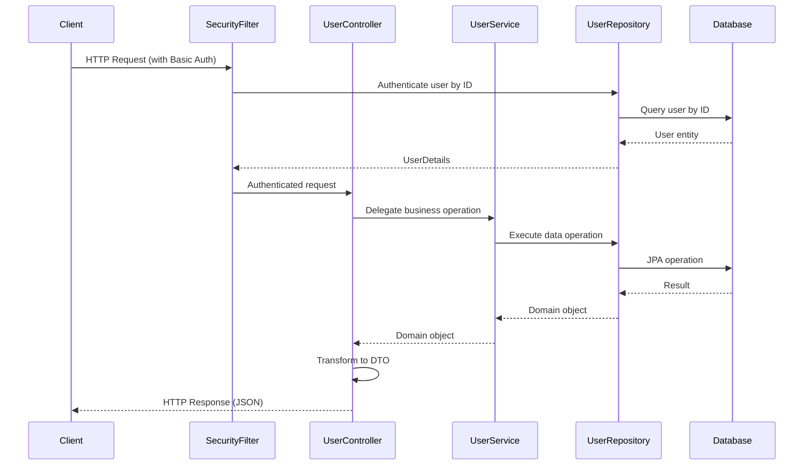

# System Architecture

## System Overview

The User API is a Spring Boot 3.2 application implementing a classic 3-tier architecture (Controller → Service → Repository) for user management. It uses Spring Data JPA for data persistence with H2 in-memory database, Spring Security for authentication/authorization, and provides RESTful endpoints following REST best practices. The application is containerized using Docker and includes comprehensive observability through Spring Boot Actuator and API documentation via SpringDoc OpenAPI.

## Architecture Diagram

## Component Descriptions

### UserController
- **Purpose**: REST API endpoint handler for user management operations
- **Responsibilities**: 
  - Expose HTTP endpoints under `/api/users` for user CRUD operations
  - Validate incoming requests using Bean Validation
  - Transform domain models to DTOs (Data Transfer Objects)
  - Handle HTTP-specific concerns (status codes, headers)
- **Dependencies**: UserService
- **Type**: Application - Presentation Layer
- **Current State**: Skeleton implementation with no endpoints yet defined

### UserService
- **Purpose**: Business logic orchestration for user operations
- **Responsibilities**:
  - Implement user profile management logic
  - Apply business rules and validations
  - Coordinate transactions
  - Handle domain-specific exceptions
- **Dependencies**: UserRepository
- **Type**: Application - Business Logic Layer
- **Current State**: Skeleton implementation ready for business logic

### UserRepository
- **Purpose**: Data access interface for user entities
- **Responsibilities**:
  - Provide CRUD operations via Spring Data JPA
  - Support custom queries when needed
  - Abstract database-specific operations
- **Dependencies**: Spring Data JPA, H2 Database
- **Type**: Application - Data Access Layer
- **Current State**: Fully functional JPA repository extending JpaRepository

### User (Entity)
- **Purpose**: Domain model representing a user in the system
- **Responsibilities**:
  - Define user data structure (id, name, email, role, active)
  - Enforce database constraints (nullable=false, unique email)
  - Map to database table via JPA annotations
- **Dependencies**: Jakarta Persistence API
- **Type**: Domain Model
- **Current State**: Fully implemented entity with all fields

### UserResponse (DTO)
- **Purpose**: Data transfer object for outbound user data
- **Responsibilities**:
  - Provide clean API response structure
  - Transform User entity to response format
  - Hide internal entity structure from clients
- **Dependencies**: User entity
- **Type**: DTO
- **Current State**: Implemented as Java record with factory method

### UpdateUserRequest (DTO)
- **Purpose**: Data transfer object for user update requests
- **Responsibilities**:
  - Validate incoming update requests
  - Currently supports updating active status only
- **Dependencies**: Jakarta Validation
- **Type**: DTO
- **Current State**: Implemented as Java record with @NotNull validation

### SecurityConfig
- **Purpose**: Configure authentication, authorization, and security policies
- **Responsibilities**:
  - Configure HTTP Basic Authentication with database-backed users
  - Define role-based access control rules
  - Configure CORS policies
  - Disable CSRF for REST API
  - Allow public access to H2 console, Actuator, and API docs
- **Dependencies**: Spring Security, UserRepository
- **Type**: Configuration
- **Current State**: Fully configured with UserDetailsService using user ID as username

### GlobalExceptionHandler
- **Purpose**: Centralized exception handling for REST API
- **Responsibilities**:
  - Catch and transform exceptions to HTTP responses
  - Provide consistent error response format
  - Handle ResourceNotFoundException (404), BadRequestException (400), ForbiddenException (403)
- **Dependencies**: Spring Web
- **Type**: Infrastructure - Exception Handling
- **Current State**: Fully implemented with custom exception handlers

### UserApiApplication
- **Purpose**: Spring Boot application entry point
- **Responsibilities**:
  - Bootstrap Spring application context
  - Enable component scanning and auto-configuration
- **Dependencies**: Spring Boot
- **Type**: Application - Main Class
- **Current State**: Standard Spring Boot main class

## Data Flow

## Integration Points

### External APIs
- None currently - this is a standalone user management service

### Databases
- **H2 In-Memory Database**
  - **Purpose**: Development and testing database
  - **URL**: `jdbc:h2:mem:userdb`
  - **Schema**: Managed by Hibernate with `create-drop` strategy
  - **Access**: H2 Console enabled at `/h2-console`

### Third-party Services
- **SpringDoc OpenAPI**: Auto-generates API documentation at `/swagger-ui.html` and `/v3/api-docs`
- **Spring Boot Actuator**: Provides health checks and monitoring at `/actuator/**`

## Infrastructure Components

### Build System
- **Maven 3.9**: Build and dependency management
- **Spring Boot Maven Plugin**: Packaging and executable JAR generation

### Deployment Model
- **Container**: Multi-stage Docker build using eclipse-temurin:21 base images
- **Runtime**: Java 21 JRE on Alpine Linux
- **Port**: Exposes port 8080

### Networking
- **CORS**: Configured to allow all origins, methods, and headers with credentials
- **HTTP Basic Auth**: Username = user's database ID, Password = "password" (hardcoded for demo)
- **Public Endpoints**: H2 console, Actuator, Swagger UI
- **Protected Endpoints**: All `/api/**` endpoints require authentication

### Security Configuration
- **Authentication Method**: HTTP Basic Authentication
- **User Store**: Database-backed via UserDetailsService
- **Authorization**: Role-based access control (ROLE_USER, ROLE_ADMIN)
- **Password Encoding**: NoOpPasswordEncoder (demo only - **not production-ready**)
- **CSRF**: Disabled for REST API
- **Frame Options**: Disabled to allow H2 Console embedding

## Technology Stack Summary

- **Core Framework**: Spring Boot 3.2.3
- **Runtime**: Java 21
- **Build Tool**: Maven 3.9
- **Web Framework**: Spring Web (REST)
- **Data Access**: Spring Data JPA
- **Security**: Spring Security
- **Validation**: Jakarta Bean Validation
- **Database**: H2 (in-memory)
- **API Documentation**: SpringDoc OpenAPI 2.3.0
- **Monitoring**: Spring Boot Actuator
- **Testing**: JUnit 5, Mockito, Spring Test
- **Containerization**: Docker (eclipse-temurin:21-jre-alpine)
