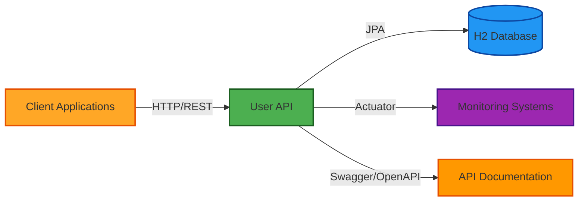

# Business Overview

## Business Context Diagram

## Business Description

- **Business Description**: The User API is a user management system that provides REST-based services for managing user accounts within an organization. The system handles user profile information, role assignments, and account status management (active/inactive). It serves as a foundational identity and access management component that can be integrated into larger business applications.

- **Business Transactions**: 
  1. **User Profile Retrieval** - Retrieve user account information by user ID
  2. **User Profile Update** - Update user profile attributes (name, email, role, active status)
  3. **User Account Activation/Deactivation** - Toggle user account active status
  4. **User Authentication** - Authenticate users via HTTP Basic Auth using user ID and password
  5. **User Authorization** - Verify user roles and permissions for API access

- **Business Dictionary**:
  - **User**: A person or system entity with an account in the system, identified by a unique ID
  - **Profile**: Collection of user attributes including name, email, role, and active status
  - **Role**: Permission level assigned to a user (e.g., USER, ADMIN) determining access rights
  - **Active Status**: Boolean flag indicating whether a user account is currently enabled
  - **Authentication**: Process of verifying user identity using credentials (user ID + password)
  - **Authorization**: Process of verifying user has permission to access specific resources based on role

## Component Level Business Descriptions

### User API Application
- **Purpose**: Core Spring Boot application providing RESTful user management services
- **Responsibilities**: 
  - Expose REST endpoints for user profile operations
  - Manage user lifecycle (retrieval, updates, activation/deactivation)
  - Enforce security policies and role-based access control
  - Provide API documentation via Swagger/OpenAPI
  - Support health monitoring and observability via Spring Actuator

### User Model (Domain Layer)
- **Purpose**: Represent user entities and their attributes in the business domain
- **Responsibilities**:
  - Define user data structure (id, name, email, role, active status)
  - Enforce data integrity constraints (unique email, required fields)
  - Map to database schema via JPA annotations

### User Controller (Presentation Layer)
- **Purpose**: Handle HTTP requests and responses for user-related operations
- **Responsibilities**:
  - Define REST API endpoints under `/api/users`
  - Validate incoming request data
  - Delegate business logic to UserService
  - Transform domain objects to DTOs for API responses

### User Service (Business Logic Layer)
- **Purpose**: Implement core business logic for user management operations
- **Responsibilities**:
  - Orchestrate user profile operations
  - Apply business rules and validations
  - Coordinate with UserRepository for data persistence
  - Handle transaction management

### User Repository (Data Access Layer)
- **Purpose**: Provide data persistence and retrieval for user entities
- **Responsibilities**:
  - Abstract database operations using Spring Data JPA
  - Execute CRUD operations on user data
  - Support custom queries for user lookups

### Security Configuration
- **Purpose**: Enforce authentication and authorization policies
- **Responsibilities**:
  - Configure HTTP Basic Authentication using database-backed users
  - Define role-based access control rules
  - Manage CORS policies for cross-origin requests
  - Protect endpoints based on authentication status

### Exception Handling
- **Purpose**: Standardize error responses across the API
- **Responsibilities**:
  - Catch and transform exceptions to HTTP error responses
  - Provide consistent error message format (timestamp, status, message, path)
  - Handle resource not found, bad request, and forbidden access scenarios
