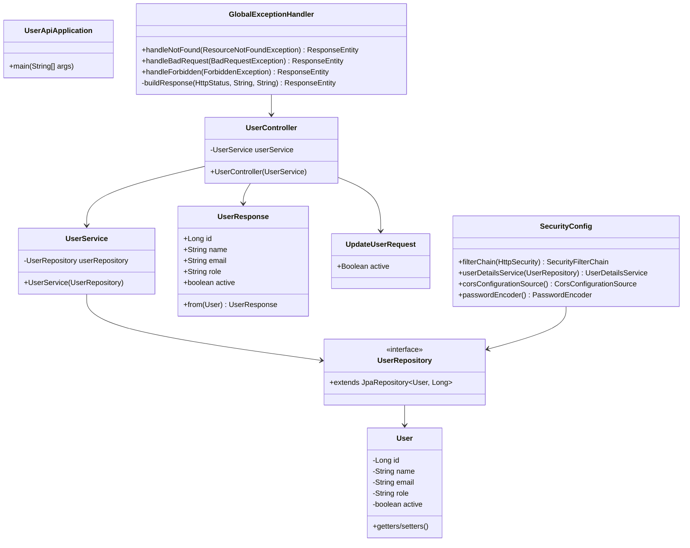

# Code Structure

## Build System

- **Type**: Maven 3.9
- **Configuration**: `pom.xml` at repository root
- **Parent**: Spring Boot Starter Parent 3.2.3
- **GroupId**: `com.sandbox`
- **ArtifactId**: `user-api`
- **Version**: `0.0.1-SNAPSHOT`
- **Java Version**: 21
- **Packaging**: JAR (executable Spring Boot application)

### Key Maven Dependencies

| Dependency | Version | Purpose |
|------------|---------|---------|
| spring-boot-starter-web | 3.2.3 | REST API framework |
| spring-boot-starter-data-jpa | 3.2.3 | JPA data access |
| spring-boot-starter-security | 3.2.3 | Authentication & authorization |
| spring-boot-starter-validation | 3.2.3 | Bean validation |
| spring-boot-starter-actuator | 3.2.3 | Monitoring & health checks |
| springdoc-openapi-starter-webmvc-ui | 2.3.0 | OpenAPI/Swagger documentation |
| h2 | (Spring managed) | In-memory database |
| spring-boot-starter-test | 3.2.3 | Testing framework (JUnit, Mockito) |
| spring-security-test | 3.2.3 | Security testing utilities |

### Maven Plugins

- **spring-boot-maven-plugin**: Creates executable JAR with embedded Tomcat

## Package Structure

```
com.sandbox.userapi/
├── UserApiApplication.java          # Spring Boot main class
├── config/                          # Configuration classes
│   └── SecurityConfig.java          # Security, CORS, auth configuration
├── controller/                      # REST API endpoints
│   └── UserController.java          # User management endpoints
├── dto/                             # Data Transfer Objects
│   ├── UpdateUserRequest.java       # Request DTO for user updates
│   └── UserResponse.java            # Response DTO for user data
├── exception/                       # Exception handling
│   ├── BadRequestException.java     # 400 Bad Request exception
│   ├── ForbiddenException.java      # 403 Forbidden exception
│   ├── GlobalExceptionHandler.java  # Global REST exception handler
│   └── ResourceNotFoundException.java # 404 Not Found exception
├── model/                           # Domain entities
│   └── User.java                    # User JPA entity
├── repository/                      # Data access layer
│   └── UserRepository.java          # User JPA repository
└── service/                         # Business logic layer
    └── UserService.java             # User business logic service
```

## Key Classes/Modules



## Existing Files Inventory

### Source Files (src/main/java/com/sandbox/userapi/)

- **`UserApiApplication.java`** - Spring Boot application entry point with @SpringBootApplication annotation
- **`config/SecurityConfig.java`** - Configures HTTP Basic Authentication, CORS, role-based access control, and custom UserDetailsService
- **`controller/UserController.java`** - REST controller skeleton mapped to `/api/users` with UserService dependency injected
- **`dto/UpdateUserRequest.java`** - Java record DTO for user update requests (currently only has `active` field with @NotNull validation)
- **`dto/UserResponse.java`** - Java record DTO for user responses with static factory method `from(User)` for transformation
- **`exception/BadRequestException.java`** - Custom runtime exception for 400 Bad Request scenarios
- **`exception/ForbiddenException.java`** - Custom runtime exception for 403 Forbidden scenarios
- **`exception/GlobalExceptionHandler.java`** - @RestControllerAdvice for global exception handling with standardized JSON error responses
- **`exception/ResourceNotFoundException.java`** - Custom runtime exception for 404 Not Found scenarios
- **`model/User.java`** - JPA entity with fields: id (auto-generated), name, email (unique), role, active (default true)
- **`repository/UserRepository.java`** - Spring Data JPA repository interface extending JpaRepository<User, Long>
- **`service/UserService.java`** - Service skeleton with UserRepository dependency injected, ready for business logic implementation

### Test Files (src/test/java/com/sandbox/userapi/)

- **`controller/UserControllerTest.java`** - Spring Boot integration test with MockMvc, sets up test data (admin and regular user), has basic context load test
- **`service/UserServiceTest.java`** - Unit test with Mockito for UserService, has basic context load test

### Configuration Files

- **`src/main/resources/application.yml`** - Spring Boot configuration:
  - H2 in-memory database (`jdbc:h2:mem:userdb`)
  - JPA hibernate `create-drop` strategy
  - H2 console enabled
  - SpringDoc API docs at `/v3/api-docs` and Swagger UI at `/swagger-ui.html`

### Build & Deployment Files

- **`pom.xml`** - Maven build configuration at repository root
- **`Dockerfile`** - Multi-stage Docker build (Maven build stage + JRE runtime stage)
- **`mkdocs.yaml`** - Documentation site configuration (possibly for GitHub Pages or similar)
- **`pyproject.toml`** - Python project configuration (likely for docs generation with MkDocs)
- **`pytest.ini`** - Python test configuration (likely for documentation tests)

### Documentation Files

- **`docs/CHANGELOG.md`** - Project changelog for tracking changes over time
- **`docs/design-doc.md`** - High-level design document describing 3-layer architecture

## Design Patterns

### Layered Architecture (3-Tier)
- **Location**: Throughout application
- **Purpose**: Separate concerns into presentation, business logic, and data access layers
- **Implementation**: 
  - **Presentation Layer**: UserController handles HTTP requests/responses
  - **Business Logic Layer**: UserService orchestrates business operations
  - **Data Access Layer**: UserRepository abstracts database operations

### Repository Pattern
- **Location**: UserRepository interface
- **Purpose**: Abstract data access logic and provide a collection-like interface for domain entities
- **Implementation**: Spring Data JPA repository extending JpaRepository with automatic CRUD implementations

### Data Transfer Object (DTO) Pattern
- **Location**: dto package (UserResponse, UpdateUserRequest)
- **Purpose**: Separate internal domain model from external API representation
- **Implementation**: Java records for immutable DTOs with validation annotations

### Dependency Injection
- **Location**: All components (controllers, services, configurations)
- **Purpose**: Manage dependencies and promote testability
- **Implementation**: Constructor-based dependency injection using Spring's IoC container

### Global Exception Handling
- **Location**: GlobalExceptionHandler with @RestControllerAdvice
- **Purpose**: Centralize exception handling and provide consistent error responses
- **Implementation**: @ExceptionHandler methods for different exception types with standardized JSON error format

### Factory Method Pattern
- **Location**: UserResponse.from(User) static method
- **Purpose**: Encapsulate object creation logic
- **Implementation**: Static factory method for creating UserResponse from User entity

### Builder Pattern
- **Location**: SecurityConfig.userDetailsService() using User.builder()
- **Purpose**: Construct complex UserDetails objects
- **Implementation**: Spring Security's User.builder() for creating UserDetails instances

## Critical Dependencies

### Spring Boot Starter Web
- **Version**: 3.2.3 (managed by Spring Boot parent)
- **Usage**: 
  - REST controller support (@RestController, @RequestMapping)
  - Embedded Tomcat server
  - JSON serialization/deserialization via Jackson
  - MVC infrastructure
- **Purpose**: Foundation for building RESTful APIs

### Spring Boot Starter Data JPA
- **Version**: 3.2.3
- **Usage**:
  - JPA entity management (@Entity, @Table, @Column)
  - Repository interfaces (JpaRepository)
  - Transaction management (@Transactional)
  - Hibernate as JPA implementation
- **Purpose**: Simplify database access with ORM

### Spring Boot Starter Security
- **Version**: 3.2.3
- **Usage**:
  - HTTP Basic Authentication
  - UserDetailsService for custom authentication
  - Role-based authorization
  - SecurityFilterChain configuration
  - CORS configuration
- **Purpose**: Secure REST endpoints with authentication and authorization

### Spring Boot Starter Validation
- **Version**: 3.2.3
- **Usage**:
  - Bean Validation annotations (@NotNull, @Valid)
  - Request validation in controllers
  - Custom validation logic
- **Purpose**: Validate incoming requests and domain objects

### SpringDoc OpenAPI
- **Version**: 2.3.0
- **Usage**:
  - Auto-generate OpenAPI 3.0 specification
  - Provide Swagger UI for API exploration
  - Document REST endpoints via annotations
- **Purpose**: API documentation and testing interface

### H2 Database
- **Version**: Managed by Spring Boot (runtime scope)
- **Usage**:
  - In-memory database for development/testing
  - SQL compatibility layer
  - Web console for database inspection
- **Purpose**: Lightweight database for rapid development

### Spring Boot Starter Test
- **Version**: 3.2.3 (test scope)
- **Usage**:
  - JUnit 5 for test structure
  - Mockito for mocking
  - AssertJ for fluent assertions
  - @SpringBootTest for integration tests
  - MockMvc for controller testing
- **Purpose**: Comprehensive testing framework

## Code Quality Indicators

### Test Structure
- **Unit Tests**: UserServiceTest using Mockito for isolated service testing
- **Integration Tests**: UserControllerTest using @SpringBootTest and MockMvc
- **Test Data Setup**: @BeforeEach methods initialize test data in repositories
- **Coverage**: Limited - only context loading tests present, no actual business logic tests yet

### Code Organization
- **Package Structure**: Clean separation by layer (controller, service, repository, model, dto, exception, config)
- **Naming Conventions**: Consistent and descriptive class names following Spring conventions
- **Layer Separation**: Clear boundaries between presentation, business, and data layers

### Modern Java Features
- **Java 21**: Using latest LTS version
- **Records**: DTO classes use Java records for immutability (UserResponse, UpdateUserRequest)
- **Constructor Injection**: All dependencies injected via constructors (recommended practice)

### Security Considerations
- **Authentication**: Database-backed UserDetailsService
- **Authorization**: Role-based access control configured
- **CORS**: Explicitly configured for cross-origin requests
- **⚠️ WARNING**: NoOpPasswordEncoder used (NOT production-ready - passwords are not hashed)
- **⚠️ WARNING**: Hardcoded password "password" in UserDetailsService

### API Design
- **RESTful Structure**: Controllers follow REST conventions
- **DTO Pattern**: Separates internal models from API contracts
- **Exception Handling**: Centralized with consistent error response format
- **Documentation**: OpenAPI/Swagger integration for automatic API docs

## Technical Observations

### Strengths
- Clean layered architecture with good separation of concerns
- Modern Spring Boot 3.2 with Java 21
- Comprehensive security setup with Spring Security
- API documentation via SpringDoc OpenAPI
- Docker support for containerization
- Exception handling infrastructure in place

### Areas for Improvement
- **No Actual Endpoints**: UserController is a skeleton with no implemented endpoints
- **No Business Logic**: UserService is empty - no methods implemented
- **Test Coverage**: Only context loading tests exist - no real test cases
- **Security**: NoOpPasswordEncoder and hardcoded passwords are NOT production-ready
- **H2 Database**: In-memory database - data lost on restart (suitable for dev/test only)
- **Validation**: UpdateUserRequest only has one field - incomplete for full profile updates
- **Missing DTOs**: No DTO for user creation requests
- **No Logging**: No explicit logging configuration or usage visible

### Readiness State
- **Infrastructure**: ✅ Fully configured and ready (Spring Boot, Security, JPA, OpenAPI)
- **Domain Model**: ✅ User entity complete with all fields
- **Exception Handling**: ✅ Complete with global handler and custom exceptions
- **Business Logic**: ⚠️ Not implemented - services are empty
- **REST Endpoints**: ⚠️ Not implemented - controllers are empty
- **Tests**: ⚠️ Minimal - only context loading tests
