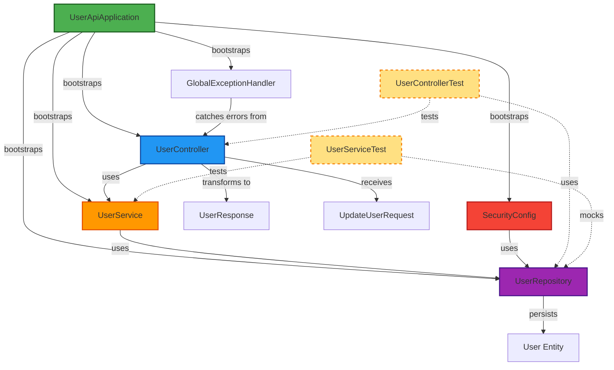

# Component Inventory

## Application Packages

### com.sandbox.userapi
- **Type**: Main application package
- **Purpose**: Spring Boot application entry point and core business logic
- **Components**:
  - UserApiApplication - Spring Boot main class
  - config/ - Configuration classes (SecurityConfig)
  - controller/ - REST API endpoints (UserController)
  - dto/ - Data Transfer Objects (UserResponse, UpdateUserRequest)
  - exception/ - Exception handling (GlobalExceptionHandler, custom exceptions)
  - model/ - Domain entities (User)
  - repository/ - Data access interfaces (UserRepository)
  - service/ - Business logic services (UserService)

## Infrastructure Packages

None - This project does not have separate infrastructure-as-code packages. Deployment infrastructure is defined in the Dockerfile.

## Shared Packages

None - This is a standalone application without shared library packages.

## Test Packages

### com.sandbox.userapi (test scope)
- **Type**: Test package mirroring main package structure
- **Purpose**: Unit and integration tests
- **Components**:
  - controller/UserControllerTest - Integration tests for UserController
  - service/UserServiceTest - Unit tests for UserService

## Configuration Files

### Application Configuration
- **src/main/resources/application.yml** - Spring Boot configuration
  - Database: H2 in-memory configuration
  - JPA: Hibernate settings
  - SpringDoc: API documentation paths

### Build Configuration
- **pom.xml** - Maven build configuration
  - Dependencies: Spring Boot starters, SpringDoc OpenAPI, H2
  - Plugins: Spring Boot Maven Plugin
  - Java version: 21

### Deployment Configuration
- **Dockerfile** - Multi-stage Docker build
  - Build stage: Maven 3.9 with Eclipse Temurin 21
  - Runtime stage: Eclipse Temurin 21 JRE Alpine

### Documentation Configuration
- **mkdocs.yaml** - Documentation site configuration (MkDocs)
- **pyproject.toml** - Python project configuration for docs
- **pytest.ini** - Python test configuration for docs

## Component Breakdown by Layer

### Presentation Layer (1 component)
- **UserController** - REST API endpoint handler for user operations

### Business Logic Layer (1 component)
- **UserService** - Business logic orchestration for user management

### Data Access Layer (1 component)
- **UserRepository** - JPA repository interface for user data persistence

### Domain Model (1 entity)
- **User** - User entity representing users table in database

### Data Transfer Objects (2 components)
- **UserResponse** - Outbound DTO for API responses
- **UpdateUserRequest** - Inbound DTO for update requests

### Exception Handling (4 components)
- **GlobalExceptionHandler** - Centralized exception handler
- **ResourceNotFoundException** - 404 Not Found exception
- **BadRequestException** - 400 Bad Request exception
- **ForbiddenException** - 403 Forbidden exception

### Configuration (1 component)
- **SecurityConfig** - Security, authentication, authorization, and CORS configuration

### Application Entry Point (1 component)
- **UserApiApplication** - Spring Boot main class

## Test Components

### Integration Tests (1 component)
- **UserControllerTest** - Integration test using @SpringBootTest and MockMvc

### Unit Tests (1 component)
- **UserServiceTest** - Unit test using Mockito for service layer

## Total Count

- **Total Components**: 14 (excluding test components)
- **Application Components**: 12
  - Presentation Layer: 1
  - Business Logic Layer: 1
  - Data Access Layer: 1
  - Domain Model: 1
  - DTOs: 2
  - Exception Handling: 4
  - Configuration: 1
  - Application Entry: 1
- **Infrastructure Components**: 0
- **Shared Libraries**: 0
- **Test Components**: 2
- **Configuration Files**: 7

## Component Dependency Graph

## Component Status Summary

| Component | Status | Completeness |
|-----------|--------|--------------|
| UserApiApplication | ✅ Complete | 100% - Standard Spring Boot main class |
| SecurityConfig | ✅ Complete | 100% - Fully configured with auth, CORS, UserDetailsService |
| UserController | ⚠️ Skeleton | 0% - No endpoints implemented |
| UserService | ⚠️ Skeleton | 0% - No business logic implemented |
| UserRepository | ✅ Complete | 100% - JPA repository with automatic CRUD |
| User (Entity) | ✅ Complete | 100% - All fields defined with JPA annotations |
| UserResponse | ✅ Complete | 100% - DTO with factory method |
| UpdateUserRequest | ⚠️ Partial | 20% - Only `active` field, missing name/email/role |
| GlobalExceptionHandler | ✅ Complete | 100% - Handles all custom exceptions |
| ResourceNotFoundException | ✅ Complete | 100% - Custom exception defined |
| BadRequestException | ✅ Complete | 100% - Custom exception defined |
| ForbiddenException | ✅ Complete | 100% - Custom exception defined |
| UserControllerTest | ⚠️ Minimal | 10% - Only context loading test |
| UserServiceTest | ⚠️ Minimal | 10% - Only context loading test |

## Key Observations

### Strengths
- Well-organized package structure following Spring Boot conventions
- Clear layer separation (controller, service, repository)
- Complete infrastructure components (security, exception handling)
- Modern Java 21 with records for DTOs
- Docker support for containerization

### Gaps
- No actual REST endpoint implementations in UserController
- No business logic in UserService
- Minimal test coverage (only context loading tests)
- UpdateUserRequest DTO is incomplete for full profile updates
- No custom query methods in UserRepository (e.g., findByEmail)

### Readiness for "Update Profile" Feature
- **Infrastructure**: ✅ Ready (Spring Boot, Security, JPA all configured)
- **Domain Model**: ✅ Ready (User entity complete)
- **DTOs**: ⚠️ Partial (UpdateUserRequest needs extension)
- **Endpoint**: ❌ Not implemented
- **Business Logic**: ❌ Not implemented
- **Tests**: ❌ Not implemented
