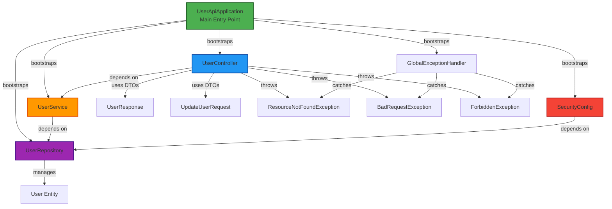

# Dependencies

## Internal Dependencies

This is a standalone monolithic application with no internal package dependencies. All components are part of the same Maven module and share the same classpath.

### Component Dependencies Within Application



### Component Dependency Matrix

| Component | Depends On | Type | Reason |
|-----------|------------|------|---------|
| UserApiApplication | All components | Compile | Spring Boot bootstraps all beans |
| UserController | UserService | Compile | Delegates business logic |
| UserController | UserResponse, UpdateUserRequest | Compile | DTO transformation |
| UserController | Custom Exceptions | Compile | Error handling |
| UserService | UserRepository | Compile | Data access |
| UserRepository | User Entity | Compile | Entity persistence |
| SecurityConfig | UserRepository | Compile | User authentication lookup |
| GlobalExceptionHandler | Custom Exceptions | Compile | Exception catching |

### Dependency Type Breakdown

- **Compile Dependencies**: All internal dependencies are compile-time dependencies
- **Runtime Dependencies**: None (no runtime-only internal dependencies)
- **Test Dependencies**: Test classes depend on main classes for testing

## External Dependencies

### Spring Boot Dependencies (Starters)

#### spring-boot-starter-web
- **Version**: 3.2.3 (managed by Spring Boot parent)
- **Purpose**: REST API development with Spring MVC
- **Scope**: Compile
- **Transitive Dependencies**:
  - spring-web, spring-webmvc - Core web framework
  - jackson-databind - JSON serialization
  - tomcat-embed-core - Embedded Tomcat server
  - spring-boot-starter - Core Spring Boot
- **Usage**: UserController, GlobalExceptionHandler, REST endpoints

#### spring-boot-starter-data-jpa
- **Version**: 3.2.3
- **Purpose**: JPA-based data access with Spring Data
- **Scope**: Compile
- **Transitive Dependencies**:
  - hibernate-core - JPA implementation (ORM)
  - spring-data-jpa - Spring Data repositories
  - jakarta.persistence-api - JPA specification
  - spring-orm - Spring ORM support
- **Usage**: UserRepository, User entity, data persistence

#### spring-boot-starter-security
- **Version**: 3.2.3
- **Purpose**: Authentication and authorization
- **Scope**: Compile
- **Transitive Dependencies**:
  - spring-security-web - Web security filters
  - spring-security-config - Security configuration
  - spring-security-core - Core security abstractions
- **Usage**: SecurityConfig, HTTP Basic Auth, role-based access control

#### spring-boot-starter-validation
- **Version**: 3.2.3
- **Purpose**: Bean validation using Jakarta Validation API
- **Scope**: Compile
- **Transitive Dependencies**:
  - hibernate-validator - Validation implementation
  - jakarta.validation-api - Validation specification
- **Usage**: UpdateUserRequest (@NotNull validation)

#### spring-boot-starter-actuator
- **Version**: 3.2.3
- **Purpose**: Production-ready monitoring and management
- **Scope**: Compile
- **Transitive Dependencies**:
  - micrometer-core - Metrics collection
  - spring-boot-actuator - Core actuator functionality
- **Usage**: Health checks, monitoring endpoints (/actuator/**)

### Third-Party Dependencies

#### springdoc-openapi-starter-webmvc-ui
- **Version**: 2.3.0
- **Purpose**: OpenAPI 3.0 specification and Swagger UI generation
- **Scope**: Compile
- **Transitive Dependencies**:
  - springdoc-openapi-webmvc-core - Core OpenAPI support
  - swagger-ui - Interactive API documentation UI
- **Usage**: API documentation at /swagger-ui.html and /v3/api-docs

### Database Dependencies

#### h2
- **Version**: Managed by Spring Boot (latest compatible)
- **Purpose**: In-memory relational database for development/testing
- **Scope**: Runtime
- **Usage**: Data storage during application runtime

### Test Dependencies

#### spring-boot-starter-test
- **Version**: 3.2.3
- **Purpose**: Comprehensive testing support
- **Scope**: Test
- **Transitive Dependencies**:
  - junit-jupiter - JUnit 5 test framework
  - mockito-core - Mocking framework
  - assertj-core - Fluent assertions
  - hamcrest - Matcher library
  - spring-test - Spring testing utilities
- **Usage**: UserServiceTest, UserControllerTest

#### spring-security-test
- **Version**: Managed by Spring Boot
- **Purpose**: Security testing utilities
- **Scope**: Test
- **Usage**: Testing authentication and authorization

## External Dependency Graph

```mermaid
graph TD
    App[User API Application]
    
    App -->|uses| SBW[spring-boot-starter-web]
    App -->|uses| SBD[spring-boot-starter-data-jpa]
    App -->|uses| SBS[spring-boot-starter-security]
    App -->|uses| SBV[spring-boot-starter-validation]
    App -->|uses| SBA[spring-boot-starter-actuator]
    App -->|uses| SD[springdoc-openapi-starter]
    App -->|uses| H2[h2 database]
    
    SBW -->|includes| SpringWeb[Spring Web MVC]
    SBW -->|includes| Jackson[Jackson JSON]
    SBW -->|includes| Tomcat[Embedded Tomcat]
    
    SBD -->|includes| Hibernate[Hibernate ORM]
    SBD -->|includes| SpringData[Spring Data JPA]
    SBD -->|includes| JPA[Jakarta Persistence API]
    
    SBS -->|includes| SpringSec[Spring Security Core]
    SBS -->|includes| SecWeb[Spring Security Web]
    
    SBV -->|includes| HibVal[Hibernate Validator]
    SBV -->|includes| JakVal[Jakarta Validation API]
    
    SBA -->|includes| Micrometer[Micrometer Metrics]
    SBA -->|includes| Actuator[Spring Boot Actuator]
    
    SD -->|includes| Swagger[Swagger UI]
    SD -->|includes| OpenAPI[OpenAPI Generator]
    
    style App fill:#4CAF50,stroke:#1B5E20,stroke-width:3px
    style SBW fill:#2196F3,stroke:#0D47A1,stroke-width:2px
    style SBD fill:#FF9800,stroke:#E65100,stroke-width:2px
    style SBS fill:#F44336,stroke:#B71C1C,stroke-width:2px
    style H2 fill:#9C27B0,stroke:#4A148C,stroke-width:2px
```



## Dependency Categories

### Core Framework (Spring Boot)
- spring-boot-starter-parent (parent POM)
- spring-boot-starter-web
- spring-boot-starter-data-jpa
- spring-boot-starter-security
- spring-boot-starter-validation
- spring-boot-starter-actuator

### Data Persistence
- H2 database (runtime)
- Hibernate (via spring-boot-starter-data-jpa)
- Spring Data JPA (via spring-boot-starter-data-jpa)

### API & Documentation
- springdoc-openapi-starter-webmvc-ui

### Testing
- spring-boot-starter-test
- spring-security-test

## Dependency Licenses

| Dependency | License | Notes |
|------------|---------|-------|
| Spring Boot & Spring Framework | Apache 2.0 | Permissive, commercial-friendly |
| Hibernate | LGPL 2.1 | Permissive for linking |
| H2 Database | MPL 2.0 or EPL 1.0 | Dual license, permissive |
| Jackson | Apache 2.0 | Permissive |
| Tomcat | Apache 2.0 | Permissive |
| JUnit 5 | EPL 2.0 | Permissive |
| Mockito | MIT | Permissive |
| AssertJ | Apache 2.0 | Permissive |
| SpringDoc OpenAPI | Apache 2.0 | Permissive |

**License Compatibility**: All dependencies use permissive licenses compatible with commercial use.

## Dependency Management Strategy

### Version Management
- **Spring Boot Parent POM**: Manages most dependency versions
- **Explicit Versions**: Only springdoc-openapi-starter-webmvc-ui (2.3.0) has explicit version
- **Transitive Dependencies**: Managed automatically by Spring Boot

### Maven Dependency Plugin (Available Commands)
```bash
# Display dependency tree
mvn dependency:tree

# Analyze dependencies for conflicts
mvn dependency:analyze

# Download dependencies to local repository
mvn dependency:go-offline

# List all dependencies with versions
mvn dependency:list
```

## Dependency Security Considerations

### Known Security Issues
- **NoOpPasswordEncoder**: Deprecated and insecure - passwords not hashed
  - **Mitigation**: Replace with BCryptPasswordEncoder in production
- **H2 Database**: Not for production use
  - **Mitigation**: Replace with production-grade database (PostgreSQL, MySQL)

### Dependency Update Strategy
- **Spring Boot**: Follow LTS releases, currently on 3.2.3
- **Java**: Using Java 21 LTS (support until 2029)
- **Third-party**: Keep springdoc-openapi updated for security patches

### Vulnerability Scanning
```bash
# Check for known vulnerabilities (requires OWASP Dependency Check plugin)
mvn org.owasp:dependency-check-maven:check

# Use Snyk or similar for continuous monitoring
```

## Build Dependencies

### Maven Build Plugins

#### spring-boot-maven-plugin
- **Version**: 3.2.3 (managed by Spring Boot parent)
- **Purpose**: Package application as executable JAR
- **Configuration**: Default configuration (no explicit config in pom.xml)
- **Features Used**:
  - Repackage goal for executable JAR
  - Embed dependencies
  - Include embedded Tomcat

## Dependency Upgrade Considerations

### Safe to Upgrade
- Patch version updates within Spring Boot 3.2.x
- Minor version updates for springdoc-openapi (e.g., 2.3.x → 2.4.x)

### Requires Testing
- Spring Boot minor version updates (e.g., 3.2.x → 3.3.x)
- Spring Boot major version updates (e.g., 3.x → 4.x)
- Java version updates (e.g., Java 21 → Java 22+)

### Breaking Changes Risk
- Spring Boot 3.x → 4.x (future)
- Java 21 → Java 22+ (may introduce deprecations)
- Jakarta EE namespace changes (already using Jakarta, stable)

## Circular Dependency Analysis

**Status**: No circular dependencies detected

**Validation**:
- UserController → UserService → UserRepository (linear)
- SecurityConfig → UserRepository (independent path)
- No component depends on UserController
- GlobalExceptionHandler has no dependencies on application components

## Dependency Summary Statistics

- **Total External Dependencies**: ~50+ (including transitive)
- **Direct Dependencies**: 9 (7 compile, 1 runtime, 2 test)
- **Compile Scope**: 7
- **Runtime Scope**: 1 (h2)
- **Test Scope**: 2
- **Internal Components**: 14
- **License Types**: All permissive (Apache 2.0, MIT, LGPL, MPL, EPL)
