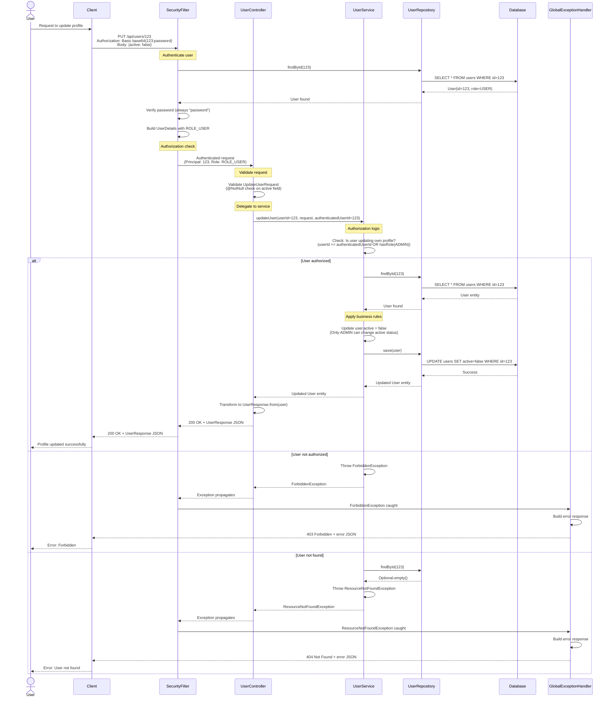
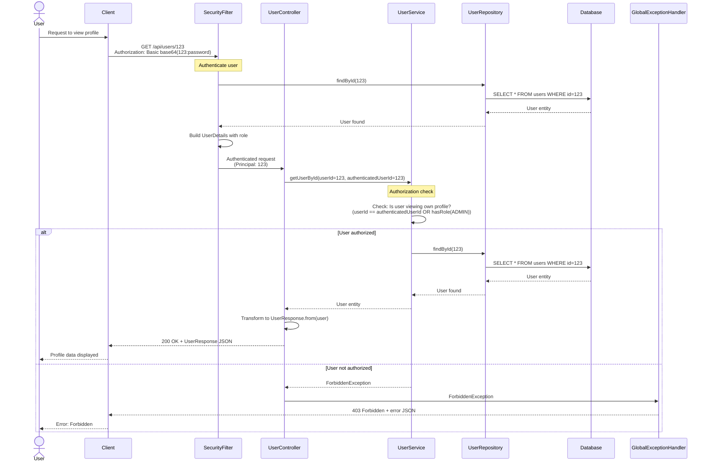
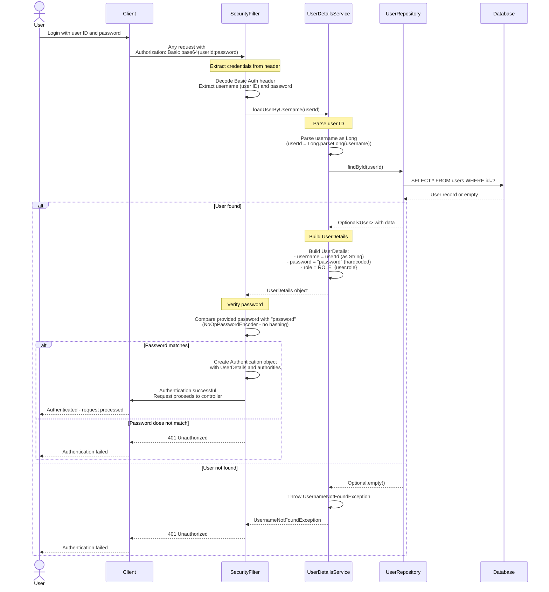
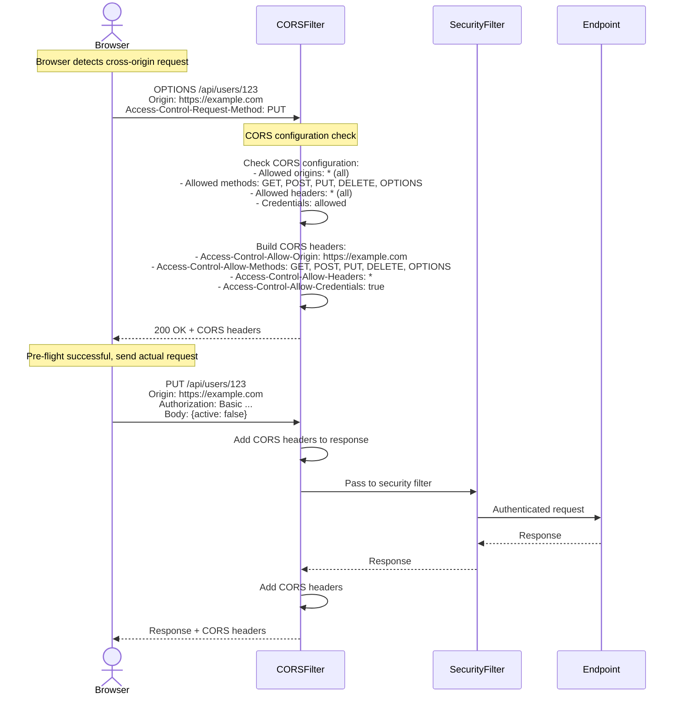
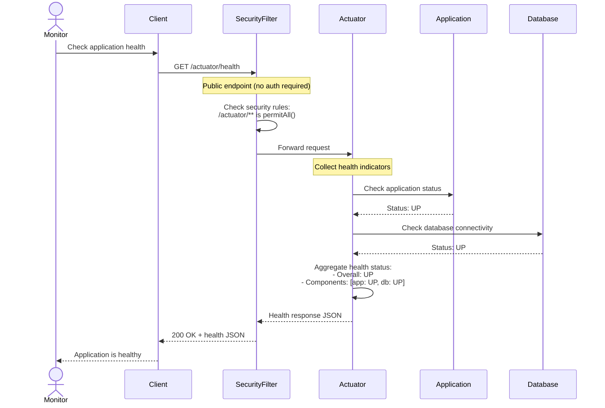
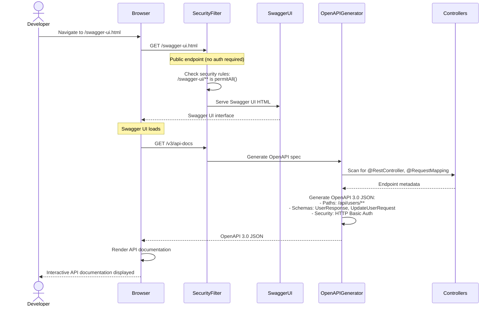

# Interaction Diagrams

This document illustrates how business transactions are implemented across components in the User API system.

## Overview

The User API currently has infrastructure in place but no implemented business transactions. This document shows both the **Current State** (infrastructure only) and **Expected State** (based on the user story "As a user, I want to update my profile").

---

## Business Transaction 1: User Profile Update (Expected)

### Business Flow



### Component Interactions

**Involved Components**:
1. **SecurityFilter** (Spring Security) - Authenticates request using HTTP Basic Auth
2. **UserController** - Receives HTTP request, validates input
3. **UserService** - Enforces authorization rules, applies business logic
4. **UserRepository** - Executes database queries
5. **Database** (H2) - Stores user data
6. **GlobalExceptionHandler** - Catches and transforms exceptions to HTTP responses

**Data Transformations**:
- **HTTP Request** → `UpdateUserRequest` DTO (via Jackson)
- **User Entity** → `UserResponse` DTO (via factory method)
- **Exceptions** → JSON error response (via GlobalExceptionHandler)

**Business Rules Applied**:
1. User must be authenticated (enforced by SecurityFilter)
2. User can only update own profile unless ADMIN role (enforced by UserService)
3. Only ADMIN can change `active` status (enforced by UserService)
4. `active` field is required in request (enforced by @NotNull validation)
5. User must exist in database (enforced by UserService)

---

## Business Transaction 2: User Profile Retrieval (Expected)

### Business Flow



---

## Business Transaction 3: User Authentication (Current - Implemented)

### Business Flow



### Component Interactions

**Involved Components**:
1. **SecurityFilter** (Spring Security FilterChain) - Intercepts all requests
2. **UserDetailsService** (Custom implementation in SecurityConfig) - Loads user from database
3. **UserRepository** - Queries database for user
4. **Database** (H2) - Stores user credentials and roles

**Current State**: ✅ Fully implemented and functional

**Security Issues**:
- Password is hardcoded as "password" for all users
- NoOpPasswordEncoder used (passwords not hashed)
- User ID used as username (not email or username field)

---

## Business Transaction 4: CORS Pre-flight Request (Current - Implemented)

### Business Flow



**Current State**: ✅ Fully implemented and functional

**Configuration**: Defined in SecurityConfig.corsConfigurationSource()

---

## Business Transaction 5: Health Check (Current - Implemented)

### Business Flow



**Current State**: ✅ Fully implemented and functional

**Accessible at**: `/actuator/health` (no authentication required)

---

## Business Transaction 6: API Documentation Access (Current - Implemented)

### Business Flow



**Current State**: ✅ Fully implemented and functional

**Accessible at**: 
- Swagger UI: `/swagger-ui.html`
- OpenAPI JSON: `/v3/api-docs`

---

## Component Communication Patterns

### Synchronous Request-Response (Primary Pattern)

All current and expected business transactions use synchronous request-response:
- Client sends HTTP request
- Server processes immediately
- Server returns HTTP response
- Client receives response

**Used in**:
- Profile updates
- Profile retrieval
- Authentication
- Health checks
- API documentation

### Layered Communication Flow

```
Client
  ↓ HTTP
SecurityFilter (Spring Security)
  ↓ Authenticated Request
Controller (Presentation Layer)
  ↓ Method Call
Service (Business Logic Layer)
  ↓ Method Call
Repository (Data Access Layer)
  ↓ JPA/SQL
Database
```

**Characteristics**:
- Each layer only communicates with adjacent layers
- No layer skipping (e.g., Controller never calls Repository directly)
- Clean separation of concerns

### Exception Propagation Pattern

```
Service throws Exception
  ↓
Controller receives Exception (propagates)
  ↓
GlobalExceptionHandler catches Exception
  ↓
Transforms to HTTP error response
  ↓
Returns to Client
```

**Used in**:
- Resource not found scenarios (404)
- Authorization failures (403)
- Validation failures (400)

---

## Current vs Expected State Summary

| Business Transaction | Status | Implementation |
|---------------------|--------|----------------|
| User Authentication | ✅ Implemented | SecurityConfig + UserDetailsService |
| CORS Pre-flight | ✅ Implemented | SecurityConfig + CORS configuration |
| Health Checks | ✅ Implemented | Spring Boot Actuator |
| API Documentation | ✅ Implemented | SpringDoc OpenAPI + Swagger UI |
| **Profile Update** | ❌ Not Implemented | Requires UserController + UserService implementation |
| **Profile Retrieval** | ❌ Not Implemented | Requires UserController + UserService implementation |

---

## Integration Points

### External Systems
- None currently - this is a standalone service

### Internal Integration
- All components integrated via Spring Dependency Injection
- Database accessed via Spring Data JPA
- Security integrated via Spring Security FilterChain

### Infrastructure Services
- **H2 Database**: In-memory relational database
- **Spring Boot Actuator**: Health and monitoring endpoints
- **SpringDoc OpenAPI**: API documentation generation
- **Jackson**: JSON serialization/deserialization (transparent)

---

## Performance Considerations

### Current Implementation
- **Synchronous blocking I/O**: All operations are blocking (suitable for CRUD operations)
- **Database queries**: One query per operation (no N+1 issues visible)
- **Connection pooling**: Managed by Spring Boot (HikariCP default)

### Potential Bottlenecks (When Implemented)
1. **Database queries in authentication**: Every request queries database for user authentication
   - **Mitigation**: Consider caching UserDetails or using token-based auth
2. **No pagination**: If listing all users, could load entire table
   - **Mitigation**: Add pagination to list endpoints
3. **No caching**: Every request hits database
   - **Mitigation**: Add Spring Cache for frequently accessed data

### Expected Performance
- **Profile retrieval**: ~10-50ms (single database query)
- **Profile update**: ~20-100ms (query + update)
- **Authentication**: ~10-50ms (single database query)
